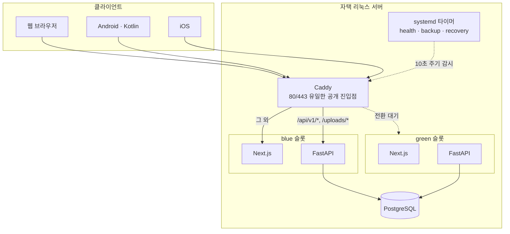

# CookieRunHUB — 개인 개발 게임 정보 서비스 엔지니어링 기록

혼자 설계·개발·운영하고 있는 게임 정보 웹서비스의 **엔지니어링 기록**입니다.
집에 둔 리눅스 서버 한 대 위에서 무중단 배포와 자동 장애 복구까지 직접 굴리고 있습니다.
**월 활성 사용자 14만 명**이 쓰는 서비스입니다. → [www.cookierunhub.com](https://www.cookierunhub.com)

> *Engineering notes on a trilingual game-information web service I have designed, built and
> operated alone for six months — 140k monthly active users, blue-green zero-downtime deploys
> and health-based automatic recovery on a Linux box at home. Code and collected data are not
> published; only the structure and the reasoning behind it. Written in Korean.*

> 이 저장소에는 코드와 데이터가 없습니다. 서비스의 콘텐츠 데이터는 직접 수집·정리한 것이라
> 공개하지 않고, 구조와 기술적 판단만 정리했습니다. 코드 열람이 필요하시면 말씀해 주세요.

## 실제 이용

Google Analytics 실측입니다. 구간은 **2026-05-10 ~ 2026-08-30 (113일)**.

| 항목 | 값 |
|---|---|
| 월 활성 사용자 (MAU) | **14만 명** |
| 주 활성 사용자 (WAU) | 5.1만 명 |
| 일 활성 사용자 (DAU) | 1.3만 명 |
| 구간 누적 활성 사용자 | 27만 명 |
| 이벤트 | 2,609만 |
| 활성 사용자당 평균 참여 시간 | **18분 02초** |
| 활성 사용자당 참여 세션 수 | 5.8회 |

18분이라는 체류 시간이 이 서비스의 성격을 가장 잘 설명합니다. 읽고 나가는 정보 페이지가
아니라 조합을 찾고 비교하고 저장하는 도구라, 한 번 들어오면 오래 머뭅니다.

### 이용자 추이와 재방문

활성 사용자는 6월 말까지 거의 0에 가까웠습니다. 7월에 검색 유입이 걸리기 시작하면서 가파르게
올랐고, 8월에는 일 활성 1~2만 명대에서 유지되고 있습니다. 광고를 집행한 적은 없습니다.

| 재방문 지표 | 값 | 뜻 |
|---|---|---|
| WAU / MAU | **35.3%** | 한 달 안에 들어온 사람 셋 중 하나가 그 주에도 들어옵니다 |
| DAU / WAU | 26.2% | 그 주 이용자의 네 명 중 한 명꼴이 하루 안에 다시 옵니다 |
| DAU / MAU | **9.2%** | 서비스가 얼마나 습관이 되었는가 |

한 번 쓰고 마는 서비스가 아니라는 것이 이 세 숫자에 들어 있습니다. 활성 사용자당 참여 세션이
5.8회라는 것도 같은 이야기입니다 — 한 사람이 평균 여섯 번 가까이 다시 열었습니다.

### 무슨 일이 일어나는가

| 이벤트 | 수 |
|---|---|
| page_view | 1,664만 |
| ad_impression | 471만 |
| session_start | 208만 |
| scroll | 117만 |
| user_engagement | 110만 |
| first_visit | 27만 |
| click | 12만 |

세션 208만 회에 페이지뷰 1,664만 — 세션당 8쪽 가까이 넘겨 봅니다. 조합 하나를 정하려고
여러 개를 열어 비교하는 사용 방식이 그대로 드러납니다.

### 3개국어가 실제로 쓰이는가

만들어 둔 것과 쓰이는 것은 다릅니다. 활성 사용자 상위 지역은 이렇습니다.

| 지역 | 활성 사용자 |
|---|---|
| Bangkok | 11만 |
| Saraburi | 1.8만 |
| Sabarang | 1.8만 |
| Nakhon Ratchasima | 1.6만 |
| Trang | 1.5만 |
| Prachuap Khiri Khan | 1.4만 |

**상위 지역이 전부 태국입니다.** 인기 페이지에서도 태국어 페이지가 2위(295만 조회)와
5위(89만 조회)에 올라 있습니다. 번역을 로케일 문자열 파일이 아니라 DB 스키마와 백그라운드
워커로 만든 판단([2번 항목](#2-3개국어를-번역-파일이-아니라-파이프라인으로))이 값을 한 자리입니다.

### 어디서 들어오는가

| 세션 소스 / 매체 | 세션 수 |
|---|---|
| google / organic | 102만 |
| (direct) / (none) | 83만 |
| accounts.google.com | 6.3만 |
| youtube.com / referral | 6.3만 |
| l.facebook.com / referral | 2.5만 |
| bing / organic | 2.4만 |

검색 유입이 가장 큰 단일 경로입니다. 광고를 집행하지 않으므로 로케일별 라우트와
canonical·hreflang 설정이 그대로 유입으로 돌아옵니다.

### 인기 페이지

| 페이지 | 조회수 | 활성 사용자 | 이탈률 |
|---|---|---|---|
| Episode Combinations (en) | 562만 | 13만 | 16.0% |
| คอมบิเนชัน — ไกด์ (th) | 295만 | 8.7만 | 15.3% |
| Episode Combination Detail (en) | 160만 | 9.8만 | 11.6% |
| Tower of Frozen Waves Guides (en) | 91만 | 5.4만 | 17.9% |
| รายละเอียดคอมบิเนชัน (th) | 89만 | 7만 | 14.4% |
| 쿠키런HUB 메인 (ko) | 58.9만 | 9.1만 | 6.2% |

메인 페이지 이탈률 6.2%는 조합 목록·상세로 이어지는 동선이 실제로 작동한다는 뜻입니다.

### 수익

같은 구간의 총수익은 **$445.18**이고 전액 광고 수익입니다(광고 노출 471만 회).
결제 기능은 두지 않아 전자상거래 수익과 구매자는 0이며, 이용자에게 직접 돈을 받지 않습니다.
규모 자체는 크지 않지만, 트래픽을 받는 것과 그 트래픽으로 운영을 지탱하는 것은 다른 문제라
여기에 함께 적어 둡니다.

## 코드 규모

| 항목 | 값 |
|---|---|
| 개발 기간 | 2026-02 ~ 현재 (6개월+, 단독 개발) |
| 커밋 | 554 |
| 코드 | TypeScript/TSX 약 11만 줄, Python 약 6.8만 줄, Kotlin 약 1.2천 줄 |
| 백엔드 도메인 모듈 | 28개 |
| DB 마이그레이션 | 148개 |
| 지원 언어 | 한국어 · 영어 · 태국어 |
| 클라이언트 | 웹(반응형) · Android · iOS |

## 아키텍처



라우팅 규칙에 함정이 하나 있습니다. `/api/*` 를 통째로 FastAPI로 넘기면 안 됩니다.
`/api/revalidate` 를 비롯한 몇몇 경로는 Next.js Route Handler이기 때문입니다.

```
/api/v1/*  → FastAPI
/uploads/* → FastAPI
/api/*     → Next.js Route Handler
그 외      → Next.js
```

## 기술적으로 신경 쓴 것들

### 1. 무중단 배포와 자동 복구를 직접 구현

관리형 PaaS가 아니라 자택 서버라, 배포 파이프라인과 장애 복구를 전부 직접 만들어야 했습니다.

- 배포 진입점은 **`main` push 하나뿐**입니다. 운영 체크아웃은 실행 전용이고 항상 clean을 유지하며,
  서버에서 고칠 일이 있으면 별도 worktree에서만 합니다.
- CI를 통과한 **정확한 commit SHA만** 배포합니다. push 전에 `.githooks/pre-push`가 CI와 동일한
  `scripts/preflight.sh --all` 을 돌리고, hook을 우회해도 GitHub Actions가 같은 검사로 막습니다.
- 새 버전은 **비활성 색상에서 먼저 검증**한 뒤 Caddy를 reload해 전환합니다. 전환에 실패하면
  이전 라우트와 배포 상태를 즉시 되돌립니다.
- 이전 버전은 전환 후 **30분간 standby**로 살려 둡니다.
- **10초 주기 health 타이머**가 active 경로를 감시합니다. 약 30초 동안 3회 연속 실패하면
  standby가 직접 health를 통과할 때만 그쪽으로 전환하고, standby가 없거나 불량이면 기존
  컨테이너를 재시작해 라우트를 복구합니다. 배포 도중 중단되어 상태가 `switching`이면 기록된
  이전 active로 되돌립니다.
- 복구기는 **새 이미지를 임의로 만들지 않습니다.** 기록된 컨테이너가 없으면 조용히 넘어가지 않고
  명시적으로 실패합니다. 배포 lock이 잡혀 있는 동안에는 손대지 않고 다음 주기에 재시도합니다.

→ 자세히: [docs/deployment.md](docs/deployment.md)

### 2. 3개국어를 "번역 파일"이 아니라 파이프라인으로

정적 문구뿐 아니라 **사용자가 작성한 게시글까지** 번역 대상입니다. 그래서 로케일 문자열 파일이
아니라 DB 스키마와 백그라운드 워커가 필요했습니다.

- 콘텐츠마다 원본 로케일(`source_locale`)을 기록하고, 번역본은 별도 테이블에 둡니다.
- 번역 워커가 큐를 소비하며, 외부 API quota를 고려해 처리량을 조절합니다.
- 폴백 순서가 언어마다 다릅니다. 영어 UI는 한국어로, 태국어 UI는 영어 → 한국어 순으로 내려갑니다.
- 로케일별 라우트(`/`, `/en/*`, `/th/*`)를 두고 canonical과 hreflang을 맞춥니다.

→ 자세히: [docs/i18n-seo.md](docs/i18n-seo.md)

### 3. 캐시를 한 겹이 아니라 계층으로

자택 서버라 CPU·메모리·대역폭·외부 API 비용이 전부 실제 제약입니다. 그래서 "일단 캐시" 대신
어느 계층에서 무엇을 무효화할지를 규칙으로 정해 두었습니다.

- Next.js ISR/revalidation과 API 응답 캐시를 분리해 다룹니다.
- 무효화는 **이벤트 기반**입니다. 넓게 쓸어버리는 무효화를 금지하고, 바뀐 것만 지웁니다.
- 요청 중복 제거(dedup)를 두어 같은 데이터를 여러 컴포넌트가 각자 부르지 않게 합니다.
- 누적 통계(예: 조합 동시조회 통계)는 갱신 경로를 따로 관리합니다.

### 4. 변경 이력을 코드와 같은 커밋에 강제

사용자에게 보이는 변경은 반드시 같은 커밋에서 3개 국어 changelog에 기록하도록 규칙을
정해 두었습니다. 관리자·운영자 전용 변경은 플레이어용 changelog에서 제외합니다.
사람이 나중에 손으로 채우는 방식은 반드시 밀리기 때문입니다.

### 5. 자택 서버 보안 경계

- 공개 포트는 Caddy의 80/443 **뿐**입니다. PostgreSQL과 관리 서비스는 절대 외부로 열지 않습니다.
- 비밀값은 저장소에 넣지 않고 `.env`로만 다룹니다.
- 마이그레이션·복구 중에는 `STARTUP_MUTATIONS_ENABLED`, `STARTUP_BACKGROUND_TASKS_ENABLED`를
  꺼서 시작 시 부작용을 차단하는 안전 모드를 둡니다.
- 백업은 systemd 타이머로 자동화하고, 오프사이트 사본을 따로 둡니다.

## 백엔드 구조 규칙

기능마다 같은 모양을 유지합니다. 라우터에 SQL이나 업무 규칙을 직접 넣지 않습니다.

```
src/<domain>/
  models.py   데이터 모델
  schemas.py  요청/응답 Pydantic 모델
  service.py  업무 규칙과 DB 접근
  router.py   HTTP 엔드포인트
```

`auth`, `board`, `combinations`, `calculator`, `game_data`, `favorites`, `friend_codes`,
`ice_tower`, `notifications`, `recommender`, `translations` 등 28개 도메인이 이 규칙을 따릅니다.

→ 자세히: [docs/architecture.md](docs/architecture.md)

## 기술 스택

**백엔드** Python 3.12 · FastAPI · SQLAlchemy (async) · PostgreSQL · Alembic · uv
**프론트엔드** TypeScript · Next.js App Router · React
**모바일** Android (Kotlin) · iOS
**인프라** 자택 Linux 서버 · Docker Compose · Caddy · systemd · GitHub Actions

## 한계와 주의

- **이 저장소에는 실행 가능한 것이 없습니다.** 코드·데이터베이스·수집 데이터는 공개하지 않고,
  구조와 기술적 판단만 문서로 정리했습니다. 코드 열람이 필요하시면 말씀해 주세요.
- 서비스의 콘텐츠 데이터와 이미지 자산은 직접 수집·정리한 것이라 공개 대상이 아닙니다.
- 위 수치(커밋·코드 줄 수·마이그레이션 개수)는 비공개 저장소 기준이며, 계속 늘어납니다.
- 자택 서버 한 대로 운영하므로 가용성은 관리형 클라우드와 같은 수준이 아닙니다. 그래서
  무중단 배포보다 **자동 복구**에 더 공을 들였습니다.

## 관련 저장소

- [sesepark/cookierun-crystal](https://github.com/sesepark/cookierun-crystal) — 다른 개발자의
  크리스탈 기댓값 계산기에 HUB 연동(서버 저장, 보안·예외 처리)을 기여했고, PR이 upstream에
  머지되었습니다.