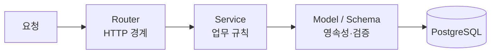

# 시스템 구조

## 계층



라우터는 HTTP 경계만 담당합니다. SQL과 업무 규칙은 서비스 아래로 내려보냅니다.
28개 도메인이 예외 없이 이 모양을 유지하기 때문에, 새 기능을 붙일 때 구조를 다시 고민하지 않습니다.

## 공통 계층

| 파일 | 역할 |
|---|---|
| `main.py` | FastAPI 앱 생성, lifespan, 라우터 등록, CORS, `/health`, `/health/ready`, 업로드 정적 마운트 |
| `config.py` | 환경변수 기반 설정. 비밀값은 `.env`에만 존재 |
| `database.py` | async SQLAlchemy 엔진·세션·공통 모델 베이스 |
| `security.py` · `rate_limit.py` · `exceptions.py` | 인증·요청 제한·오류 공통 처리 |

## 시작 작업과 백그라운드 작업

앱 lifespan에서 스키마 확인, 인덱스 확인, 번역 워커, 뉴스 수집, 추천 캐시 준비가 돌아갑니다.
이전·복구 상황에서는 이 부작용이 오히려 위험하므로, 두 스위치로 완전히 끌 수 있게 했습니다.

```
STARTUP_MUTATIONS_ENABLED=false
STARTUP_BACKGROUND_TASKS_ENABLED=false
```

평소에는 둘 다 켜 두지만, 값을 바꾸기 전에는 DB 백업과 로그 확인을 먼저 합니다.

## 성능에서 반복적으로 문제가 되는 지점

운영하면서 실제로 병목이 났던 곳들이고, 지금은 점검 체크리스트로 쓰고 있습니다.

- 목록 API의 N+1 쿼리와 pagination
- SQLAlchemy 연결 풀 크기, 느린 쿼리
- 누적 통계 갱신 경로 (조합 동시조회 통계 등)
- 번역 워커의 큐 처리량과 외부 API quota
- 이미지 업로드의 저장소 사용량
- API 응답 캐시와 Next.js ISR/revalidation 경로의 상호작용

## 프론트엔드

Next.js App Router 기준으로 227개 파일이 `app/` 아래에 있고, 컴포넌트 103개, 라이브러리 42개,
훅 16개로 구성됩니다. 로케일별 라우트를 별도 세그먼트(`/`, `/en/*`, `/th/*`)로 두어
정적 생성과 canonical 처리를 단순하게 유지합니다.

## 데이터베이스

Alembic 마이그레이션이 148개입니다. 스키마를 손으로 고치지 않고 전부 마이그레이션으로 남긴
결과이며, 덕분에 자택 서버에서도 배포와 롤백 시 스키마 상태를 추적할 수 있습니다.
