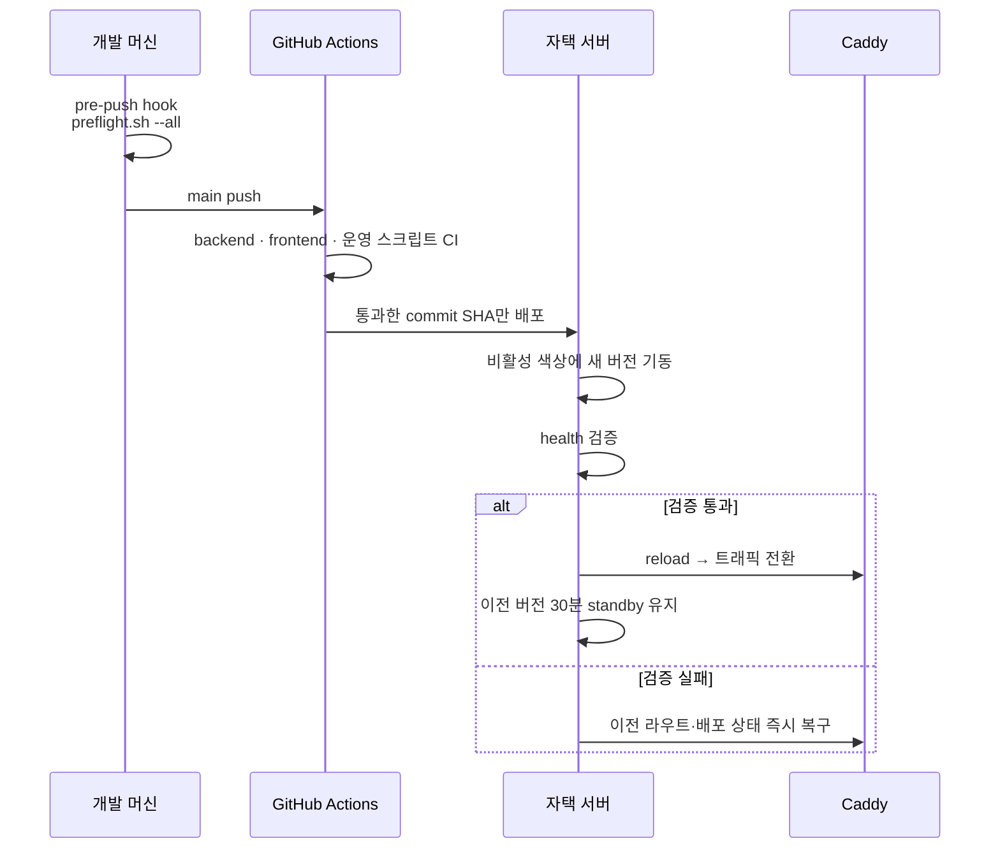

# 무중단 배포와 자동 복구

관리형 플랫폼이 아니라 자택 리눅스 서버에서 운영하기 때문에, 배포·감시·복구를 직접 만들었습니다.
목표는 하나입니다. **내가 자고 있을 때 서비스가 죽어 있으면 안 된다.**

## 배포 흐름



원칙 몇 가지를 규칙으로 굳혀 두었습니다.

- 배포의 **유일한** 진입점은 `main` push입니다.
- 운영 체크아웃(`/srv/.../app`)은 실행 전용이며 항상 clean을 유지합니다. 서버에서 수정할 일이
  생기면 반드시 별도 worktree에서 합니다.
- CI를 통과한 **정확한 commit SHA**만 배포합니다.
- 로컬 hook과 GitHub Actions가 **같은 스크립트**를 실행합니다. hook을 우회해도 CI가 막습니다.

## 자동 장애 복구

`install-operations.sh` 가 user systemd 단위로 부팅 복구와 10초 주기 health 타이머를 설치합니다.
active 경로가 약 30초 동안 3회 연속 실패하면 다음 순서로 판단합니다.

1. 30분 standby가 **직접 health를 통과하면** Caddy를 standby로 전환
2. standby가 없거나 불량이면 기존 active 컨테이너를 재시작하고 라우트 복구
3. 배포 중 프로세스가 끊겨 상태가 `switching` 이면 기록된 이전 active로 복귀

설계에서 일부러 지킨 제약이 두 가지 있습니다.

- **새 이미지를 임의로 만들지 않습니다.** 기록된 컨테이너가 없으면 그럴듯하게 넘어가는 대신
  명시적으로 실패합니다. 복구기가 예상 못 한 버전을 띄우는 쪽이 더 위험하기 때문입니다.
- **배포 lock이 잡혀 있으면 아무것도 하지 않습니다.** 배포와 복구가 동시에 상태를 건드리면
  어떤 버전이 active인지 알 수 없게 됩니다. 다음 주기에 다시 시도합니다.

standby 만료 후에는 타이머가 이전 API/frontend를 정지시키고 상태 파일에서 제거합니다.

## 운영 단위

```
ops/caddy/Caddyfile
ops/systemd/
  ├── cookierunhub-health-recovery.{service,timer}   10초 주기 감시·복구
  ├── cookierunhub-backup.{service,timer}            자동 백업
  └── cookierunhub-recovery.service                  부팅 시 복구
ops/recovery/recover-services.sh
scripts/
  ├── deploy.sh · deployment-lib.sh · deployment-state.py
  ├── verify-deployment.sh · test-deployment-ops.sh
  ├── migrate.sh · deploy-maintenance.sh
  ├── backup.sh · backup-offsite.sh
  └── preflight.sh · setup-git.sh
```

배포 스크립트 자체도 CI 대상입니다(`test-deployment-ops.sh`). 배포기를 고치다 배포를 망가뜨리는
상황을 막기 위해서입니다.

## 마이그레이션 정책

스키마 변경은 148개 Alembic 마이그레이션으로 전부 남아 있습니다. 배포 전 점검 모드를 두어
마이그레이션이 실패했을 때 서비스가 반쯤 열린 상태로 뜨지 않게 합니다.
