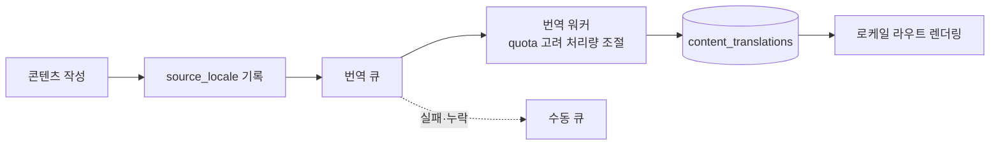

# 다국어와 검색 노출

## 왜 로케일 파일로 끝나지 않는가

UI 문구만 번역하면 되는 서비스가 아닙니다. **사용자가 쓴 게시글과 백과사전 콘텐츠까지**
세 언어로 제공해야 합니다. 그래서 정적 로케일 파일이 아니라 DB 스키마와 백그라운드 워커가
필요했습니다.



- 콘텐츠마다 원본 언어(`source_locale`)를 기록합니다. 어느 쪽이 원본인지 모르면 재번역이
  원본을 덮어써 품질이 계속 떨어집니다.
- 번역본은 원본 테이블이 아니라 별도 테이블에 둡니다.
- 워커는 외부 API quota를 감안해 처리량을 조절하고, 실패·누락 건은 수동 큐로 뺍니다.
- 백과사전 로케일은 별도 미러링 경로를 둡니다.

## 폴백 순서

언어마다 다릅니다. 한국어가 원본인 콘텐츠가 많기 때문입니다.

```
영어 UI   : en → ko
태국어 UI : th → en → ko
```

이 순서를 코드 여러 곳에서 각자 구현하면 반드시 어긋나므로, 한 곳에서 정의하고 공유합니다.

## 검색 노출

- 로케일별 라우트를 실제 경로 세그먼트로 둡니다 (`/`, `/en/*`, `/th/*`).
- canonical과 hreflang을 로케일 라우트에 맞춰 발행합니다.
- sitemap·robots·구조화 데이터를 언어별로 관리합니다.
- 기능을 추가·이동·삭제할 때 크롤링 가능성과 Search Console 노출을 함께 점검하는 것을
  개발 규칙으로 못박아 두었습니다.

## 변경 이력

사용자에게 보이는 변경은 **같은 커밋 안에서** 3개 국어 changelog에 기록합니다. 별도 관리자
화면을 만들지 않고 코드와 함께 커밋하게 만든 이유는, 사람이 나중에 채우는 방식은 반드시
밀리기 때문입니다. 관리자·운영자 전용 변경은 플레이어용 changelog에서 제외합니다.
